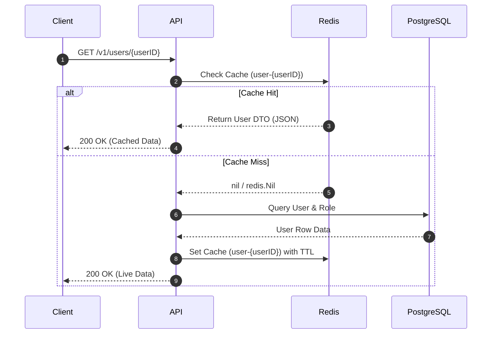
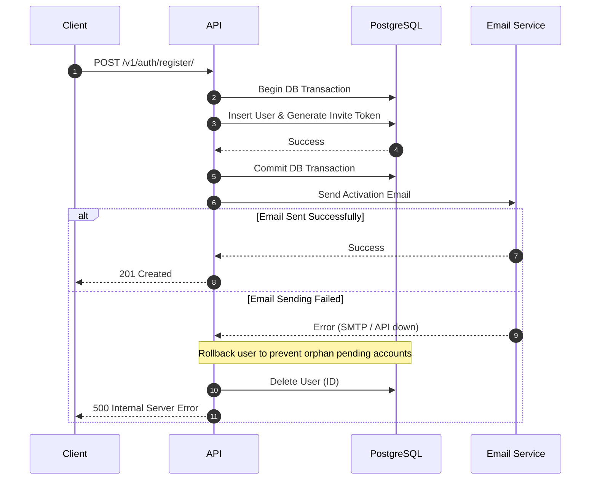

# GoSocial API 🚀

[](https://golang.org)
[](https://mit-license.org)
[](https://www.postgresql.org)
[](https://redis.io)
[](https://swagger.io)

**GoSocial** is a high-performance, production-grade RESTful social network backend API designed using Go's clean-architecture principles. Built from the ground up to be scalable, secure, and resource-efficient, it implements industry-standard design patterns such as Cache-Aside caching, Optimistic Concurrency Control, Rate Limiting, Role-Based Access Control, and Transactional Rollbacks (SAGA).

This repository serves as a showcase of writing scalable backend systems in Go, utilizing a robust tech stack without relying on bulky MVC frameworks.

---

## 🏗️ System Architecture & Key Patterns

The API follows a decoupled architectural layout, separating the routing and transport layers (`cmd/api`) from core business operations and the data persistence layers (`internal/store`).

### 1. Cache-Aside Pattern (Redis)
To reduce latency and decrease SQL database load, user profiles are cached using Redis. The system queries Redis first; on a cache miss, it fetches from PostgreSQL, caches the result with a 1-minute TTL, and returns the response.



### 2. Transactional Integrity & Email SAGA Rollback
During registration, the user creation and the generation of an activation token must occur atomically. This is wrapped in a database transaction. If the subsequent registration email (via SendGrid/Mailtrap) fails to send, the database transaction is rolled back by explicitly deleting the user record, maintaining system integrity.



### 3. Optimistic Concurrency Control (OCC)
To prevent the "Lost Update" problem during concurrent post edits, the system utilizes version-based concurrency control. Every update statement increments the post's `version` field and ensures the update only executes if the version matches the one read by the client.
```sql
UPDATE posts
SET title = $1, content = $2, version = version + 1
WHERE id = $3 AND version = $4
```

---

## 🛠️ Tech Stack & Key Libraries

* **Core Language**: Go (Golang) v1.25.4
* **HTTP Router**: `go-chi/chi/v5` - A lightweight, standard-library-compliant router that allows fast middleware chaining.
* **Database**: PostgreSQL (using `lib/pq` with raw SQL for maximum performance, database connection pooling, and control over indexes).
* **Caching**: Redis (using `go-redis/v9` client).
* **Structured Logging**: `go.uber.org/zap` - High-performance, structured logging for request metadata and service errors.
* **Security & Auth**: `golang-jwt/jwt/v5` for JSON Web Tokens (Access & Refresh tokens) and `golang.org/x/crypto/bcrypt` for secure password hashing.
* **Input Validation**: `go-playground/validator/v10` - Declarative, tag-based validation of payload structures.
* **Email Client**: Multi-provider support (SendGrid API and Mailtrap SMTP) with HTML/Text email rendering.
* **API Documentation**: Swagger 2.0 / OpenAPI integration via Go comments using `swaggo` and served dynamically through `http-swagger`.
* **Observability & Diagnostics**: Built-in runtime metric tracking using Go's `expvar` package.

---

## 📁 Project Directory Breakdown

The codebase is organized cleanly to separate configuration, application execution, and domain modules:

```text
├── cmd/
│   ├── api/             # API entry point, route definitions, middleware, and HTTP handlers
│   └── migrate/         # SQL migration scripts and database seeders
├── internal/
│   ├── auth/            # JWT Token management, generation, and verification
│   ├── cache/           # Redis cache store implementation (e.g. user-profile caching)
│   ├── db/              # Database pool setup and seeding helpers
│   ├── dto/             # Data Transfer Objects (DTOs) for strict request/response contracts
│   ├── env/             # Environment variable parsing with fallback defaults
│   ├── mailer/          # Mailing wrapper (SendGrid and Mailtrap clients) with HTML templates
│   ├── model/           # Core domain database structures/entities
│   ├── ratelimiter/     # IP-based fixed-window rate limiter middleware
│   ├── store/           # SQL repositories implementing query context timeouts & operations
│   └── utils/           # Helper libraries (e.g., password hashing, token generation)
├── web/                 # Web templates and configuration files
└── Makefile             # Development helper tasks (migrations, seeding, API generation)
```

### Module Descriptions
* **`cmd/api`**: Mounts middleware (CORS, Recoverer, Logger, Rate Limiter, Timeout), registers paths, initiates configurations, and boots the HTTP server with a graceful shutdown mechanism.
* **`internal/store`**: Implements data storage interfaces. Leverages SQL query context timeouts (`context.WithTimeout`) to prevent hanging queries from exhausting connection pools.
* **`internal/ratelimiter`**: Implements a thread-safe, IP-based Fixed-Window rate limiter to shield the API from excessive request rates.
* **`internal/auth`**: Generates and verifies cryptographic access/refresh tokens.
* **`internal/mailer`**: Employs Mailtrap in development environments and scales to SendGrid API integration for production email dispatches.

---

## 🔒 Security & Middleware Layers

To ensure security, reliability, and clean execution, requests transit through a modular middleware pipeline:

1. **Panic Recovery (`Recoverer`)**: Intercepts panic loops, logs structured tracebacks via `Zap`, and returns clean `500 Internal Server Error` responses.
2. **CORS Handling**: Safely restricts domain access by matching request origins to a configured environment variable.
3. **Context Timeout**: Limits database queries and request cycles to `60s` to prevent memory leaks and slowloris-type request exhaustion.
4. **Rate Limiting**: Enforces rate budgets (default: 20 requests per 5 seconds per IP). Returns a `429 Too Many Requests` on breach.
5. **JWT Token Authentication**: Decodes the bearer token, validates signatures and claims, and injects user identity metadata into the request context.
6. **Role-Based Authorization**: Uses database roles (`admin`, `moderator`, `user`) to determine endpoint access permissions (e.g., only admins or post creators can delete posts).

---

## 📊 Observability & Metrics

For continuous monitoring, the API exposes live application metrics under `/v1/debug/vars`.
Protected under **Basic Authentication** (admin/admin), this endpoint displays:
* Current active goroutines.
* PostgreSQL Connection Pool status (Open connections, Idle connections, wait times).
* Application version and system variables.

---

## ⚡ API Endpoints Summary

Below is an overview of the endpoints exposed by the API:

### Authentication & Public Routes
| Method | Endpoint | Auth | Description |
| :--- | :--- | :--- | :--- |
| `POST` | `/v1/auth/register` | Public | Register a new user account & dispatch confirmation email |
| `POST` | `/v1/auth/login` | Public | Authenticate user & return Access + Refresh JWT tokens |
| `PUT` | `/v1/users/activate/{token}` | Public | Activate a pending user profile using validation token |

### User Management
| Method | Endpoint | Auth | Description |
| :--- | :--- | :--- | :--- |
| `GET` | `/v1/users/{userID}` | JWT Bearer | Retrieve a user's details (retrieved via Redis cache) |
| `PUT` | `/v1/users/{userID}/follow` | JWT Bearer | Follow another user |
| `PUT` | `/v1/users/{userID}/unfollow`| JWT Bearer | Unfollow another user |
| `GET` | `/v1/users/feed` | JWT Bearer | Fetch the aggregated post feed of followed users (paginated) |

### Post & Comment Management
| Method | Endpoint | Auth | Description |
| :--- | :--- | :--- | :--- |
| `POST` | `/v1/posts` | JWT Bearer | Create a new post (attaching tags & content) |
| `GET` | `/v1/posts/{postID}` | JWT Bearer | Retrieve a post's content, tags, and comments count |
| `PATCH`| `/v1/posts/{postID}` | JWT / RBAC | Update a post (controlled by owner or moderator role) |
| `DELETE`| `/v1/posts/{postID}` | JWT / RBAC | Delete a post (controlled by owner or admin role) |
| `GET` | `/v1/posts/{postID}/comments` | JWT Bearer | Fetch comments for a post (with pagination controls) |

### Diagnostics & Docs
| Method | Endpoint | Auth | Description |
| :--- | :--- | :--- | :--- |
| `GET` | `/v1/health` | Basic Auth | General database and server health check |
| `GET` | `/v1/debug/vars` | Basic Auth | Live goroutine and DB pool statistics (expvar) |
| `GET` | `/v1/swagger/*` | Public | Interactive Swagger API Documentation |

---

## ⚙️ Getting Started & Local Setup

### 1. Prerequisites
Ensure you have the following installed:
* **Go** (v1.25.4+)
* **PostgreSQL**
* **Redis**
* **golang-migrate** CLI (for managing migrations)

### 2. Environment Configuration
Clone the repository, create your `.env` file from the updated template, and configure your credentials:
```bash
cp .env.example .env
```

### 3. Database Migrations
Run migrations using the provided Makefile to build out the SQL schemas:
```bash
make migrate-up
```
*Note: Make sure your `DB_ADDR` environment variable is set in `.env` before running migrations.*

### 4. Database Seeding
Populate your database with mock users, roles, posts, and comments for testing:
```bash
make seed
```

### 5. Running the Server
You can run the API locally using:
```bash
go run cmd/api/*.go
```
Alternatively, if you have `Air` installed for hot-reloads, simply execute:
```bash
air
```

### 6. Updating API Documentation
If you modify handlers or add new routes, regenerate the Swagger documentation using:
```bash
make gen-docs
```

---

## 📈 Key Learnings & Backend Growth

Building this project from **March 1, 2026, to June 14, 2026**, served as an intensive deep dive into production Go development. Key areas mastered during this build include:
* **Concurrency and Thread Safety**: Designing a thread-safe custom rate limiter and safely manipulating contexts across middleware.
* **SQL Profiling**: Writing optimal join queries for user activity feeds and managing connection pools.
* **Caching Strategies**: Working with cache invalidation rules and handling cache stampedes/cache misses gracefully in a distributed manner using Redis.
* **REST API Security**: Securing endpoints through stateless JWT claims and verifying hierarchical roles programmatically.
